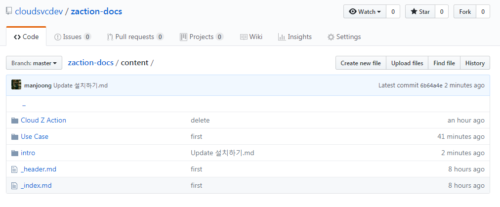

## 새 글 포스트 하기!

 

### 1. .md 파일 작성

(MarkDown: https://gist.github.com/ihoneymon/652be052a0727ad59601)

(FrontMetter: https://myshare.skcc.com/display/CZU/97.+Frontmetter)

 

### 2. content 폴더 선택

content -> 글 목록(카테고리 폴더)를 저장하는 폴더

 

### 3. 카테고리 선택

주제에 맞는 카테고리 폴더 안으로 들어간다.

 

### 4. Upload files

* "Upload files" 버튼을 눌러 md 파일 업로드
* 또는 "Create New File" 을 통해 업로드

 

### 5. Commit Changes

녹색 commit 버튼을 눌러 커밋

 

### 6. 배포 확인 (약 3~5분 소요)
https://skcloud.github.io/zaction

